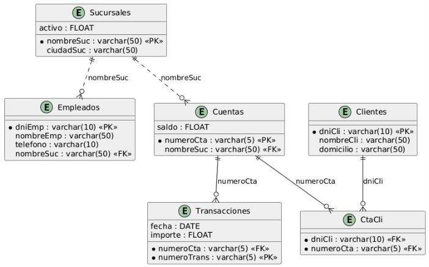

////
NO CAMBIAR!!
Codificación, idioma, tabla de contenidos, tipo de documento
////
:encoding: utf-8
:lang: es
:toc: right
:toc-title: Tabla de contenidos
:doctype: book
:linkattrs:
:icons: font
:source-highlighter: highlightjs
:imagesdir: 

////
Nombre y título del trabajo
////
# Aprendiendo SQL con la base de datos Banco
Bases de datos. Ingeniería Informática. Manuel Torres <mtorres@ual.es>


image::images/di.png[]

// NO CAMBIAR!! (Entrar en modo no numerado de apartados)
:numbered!: 


[abstract]
== Resumen
En este documento se presentan diferentes consultas SQL sobre una base de datos de un banco, mostrando distintas técnicas y operadores del lenguaje SQL.

.Objetivos
* Aprender a realizar consultas SQL básicas y avanzadas
* Comprender el uso de diferentes operadores SQL
* Entender las distintas formas de unir tablas
* Practicar con casos reales de una base de datos bancaria

// Entrar en modo numerado de apartados
:numbered:

== Esquema de la base de datos

Este esquema muestra la estructura de la base de datos Banco, que incluye las tablas `Clientes`, `Cuentas`, `Empleados`, `CtaCli` y `Sucursales`. Cada tabla tiene sus respectivos campos y relaciones. El diagrama ha sido obtenido mediante sintaxis https://plantuml.com/es/ie-diagram[PlantUML para diagramas relacionales].




== Consultas SQL sobre la base de datos Banco

=== Consultas básicas

==== Visualización de datos de clientes
[source,sql]
----
SELECT  *
FROM    Clientes
----
Esta consulta muestra todos los campos de la tabla Clientes, permitiendo ver la estructura completa de los datos almacenados.

Esta es una consulta SQL básica que recupera todos los datos de la tabla Clientes. Vamos a desglosar sus componentes:

* `SELECT \*`: Esta cláusula indica que queremos seleccionar todas las columnas disponibles en la tabla. El asterisco (`\*`) es un comodín que representa "todas las columnas".
* `FROM Clientes`: Especifica la tabla de origen de donde se obtendrán los datos, en este caso la tabla llamada `Clientes``.

**Consideraciones importantes:**

* Esta consulta devolverá todas las filas y columnas de la tabla, lo cual puede no ser eficiente si la tabla contiene muchos registros.
* En un entorno de producción, es una mejor práctica especificar solo las columnas necesarias en lugar de usar `*`.

==== Consulta selectiva de campos
[source,sql]
----
SELECT  nombrecli, domicilio
FROM    Clientes
----
Esta consulta devuelve el nombre y domicilio de todos los clientes. Se seleccionan específicamente los campos nombre y domicilio de los clientes, útil cuando solo necesitamos información específica.

La cláusula `SELECT` especifica las columnas que queremos obtener:

* `nombrecli`: Contiene el nombre del cliente
* `domicilio`: Contiene la dirección del cliente

La cláusula `FROM` indica la tabla de origen:

* `Clientes`: Es la tabla que contiene los datos de los clientes

Esta consulta devolverá una lista con dos columnas: el nombre y el domicilio de todos los clientes almacenados en la tabla. Al no incluir una cláusula `WHERE`, se mostrarán todos los registros sin ningún filtro.

Es una consulta sencilla pero común para obtener un listado básico de información de contacto de los clientes.

==== Eliminación de duplicados
[source,sql]
----
SELECT DISTINCT(nombresuc)
FROM Empleados
----

Esta consulta elimina duplicados en la columna `nombresuc` de la tabla `Empleados`, mostrando solo valores únicos. Es útil para obtener una lista de sucursales sin repeticiones. La consulta devuelve la lista de sucursales en las que hay empleados trabajando (eliminando los duplicados).

=== Consultas con filtros

==== Empleados de una sucursal
[source,sql]
----
SELECT  nombreemp, dniemp
FROM    Empleados
WHERE   nombresuc = 'Downtown'
----
Esta consulta filtra los empleados que trabajan en una sucursal específica, mostrando su nombre y DNI. En concreto, la consulta devuelve el nombre y DNI de los empleados que trabajan en la sucursal '`Downtown`'.

* Campos seleccionados:
    ** `nombreemp` (nombre del empleado)  
    ** `dniemp` (DNI o documento de identidad del empleado)

* Condición de filtrado: La cláusula `WHERE` filtra los empleados que trabajan específicamente en la sucursal '`Downtown`'

Esta consulta es útil cuando necesitas obtener un listado de empleados con sus identificaciones que trabajan en una ubicación específica. El resultado mostrará dos columnas: el nombre y el DNI de todos los empleados asignados a la sucursal Downtown.

=== Consultas con el operador `AND`

El operador `AND` se utiliza para combinar múltiples condiciones en una consulta, devolviendo resultados que cumplan todas las condiciones especificadas.

[source,sql]
----
SELECT  numerocta, saldo
FROM    Cuentas
WHERE   nombresuc = 'Perrydge'
        AND saldo > 35000
----
Demuestra el uso de múltiples condiciones para filtrar resultados, en este caso por sucursal y saldo. La consulta devuelve el número de cuenta y saldo de las cuentas en la sucursal '`Perrydge`' con un saldo superior a `35,000`.

Esta consulta SQL realiza una búsqueda específica en la tabla `Cuentas` con los siguientes criterios:

* Selecciona dos columnas específicas: `numerocta` (número de cuenta) y `saldo`
* Filtra los registros para mostrar solo las cuentas de la sucursal '`Perrydge`'
* Muestra únicamente las cuentas cuyo saldo sea superior a `35,000`

La consulta utiliza:

* La cláusula `SELECT` para especificar las columnas deseadas
* La cláusula `FROM` para indicar la tabla fuente
* La cláusula `WHERE` con dos condiciones combinadas con `AND`:
    ** `nombresuc = 'Perrydge'`
    ** `saldo > 35000`

==== Consultas con el operador `OR`

El operador `OR` se utiliza para combinar múltiples condiciones en una consulta, devolviendo resultados que cumplan al menos una de las condiciones especificadas.

[source,sql]
----
SELECT *
FROM Empleados
WHERE nombresuc = 'Downtown' 
OR nombresuc = 'Perrydge'
----

Esta consulta muestra cómo usar el operador `OR` para filtrar resultados basados en múltiples condiciones. La consulta devuelve todos los empleados que trabajan en las sucursales '`Downtown`' o '`Perrydge`'.

==== Uso del operador IN
[source,sql]
----
SELECT  *
FROM    Empleados
WHERE   nombresuc IN ('Downtown', 'Perrydge')
----
Muestra el uso del operador `IN` como alternativa a múltiples condiciones `OR`. La consulta devuelve todos los empleados que trabajan en las sucursales '`Downtown`' o '`Perrydge`'.

Esta consulta SQL realiza una operación de selección básica en la tabla `Empleados`. Vamos a desglosarla:

* `SELECT *`: Recupera todas las columnas disponibles en la tabla
* `FROM Empleados`: Indica que estamos consultando la tabla llamada "`Empleados`"
* `WHERE nombresuc IN ('Downtown', 'Perrydge')`: Filtra los resultados para mostrar solo los empleados que trabajan en las sucursales '`Downtown`' o '`Perrydge`'

El operador `IN` es una forma concisa de escribir múltiples condiciones `OR`.

==== Uso del operador BETWEEN

Si estamos interesados en un rango de valores y sólo disponemos del operador `AND`, tendríamos la siguiente consulta para obtener las cuentas con saldos entre `20,000` y `40,000`:

[source,sql]
----
SELECT  *
FROM    Cuentas
WHERE   saldo >= 20000
        AND saldo <= 40000
----

El problema de esta consulta es que se vuelve pesado el tener que escribir el operador de comparación dos veces. SQL ofrece una forma más compacta y natural para este tipo de situaciones de búsqueda en un rango de valores. Se trata del operador `BETWEEN`, que permite especificar un rango de valores de forma más sencilla. La consulta anterior podría reescribirse de la siguiente manera usando `BETWEEN`:

[source,sql]
----
SELECT  *
FROM    Cuentas
WHERE   saldo BETWEEN 20000 AND 40000
----
Demuestra el uso de BETWEEN para rangos de valores, simplificando la sintaxis de comparación. La consulta devuelve todas las cuentas con saldos entre `20,000` y `40,000`.

Esta consulta SQL realiza una búsqueda filtrada en la tabla `Cuentas` utilizando la cláusula `BETWEEN`. Vamos a desglosarla:

* `SELECT *`: Selecciona todas las columnas disponibles en la tabla
* `FROM Cuentas`: Indica que estamos consultando la tabla llamada "`Cuentas`"
* `WHERE saldo BETWEEN 20000 AND 40000`: Filtra los registros para mostrar solo aquellas cuentas cuyo saldo está entre `20,000` y `40,000` (inclusive)

Esta consulta es útil para obtener un listado de cuentas con saldos dentro de un rango específico. El operador `BETWEEN` es inclusivo, lo que significa que incluirá registros donde el saldo sea exactamente `20,000` o `40,000`, así como todos los valores intermedios.

Las consultas con `BETWEEN` son más concisas y legibles que las alternativas con múltiples operadores de comparación.

=== Consultas con patrones

==== Búsqueda con LIKE
[source,sql]
----
SELECT  *
FROM    Clientes
WHERE   domicilio LIKE 'Fragata%'
----
Ilustra el uso del operador `LIKE` para búsquedas de patrones en texto. La consulta devuelve todos los clientes cuyas direcciones comienzan con la palabra '`Fragata`'.

Esta consulta SQL realiza una búsqueda de registros en la tabla `Clientes` utilizando el operador `LIKE` para filtrar direcciones.

Analicemos cada parte:

* `SELECT *`: Selecciona todas las columnas de la tabla
* `FROM Clientes`: Indica que estamos consultando la tabla "`Clientes`"
* `WHERE domicilio LIKE 'Fragata%'`: Filtra los registros donde el campo domicilio comience con la palabra "`Fragata`"

El símbolo `%` es un comodín que representa cualquier secuencia de caracteres. Al colocarlo después de "Fragata", la consulta devolverá todos los clientes cuya dirección empiece con "Fragata", sin importar qué caracteres vengan después.

Por ejemplo, esta consulta encontraría direcciones como:

* Fragata Sarmiento 123
* Fragata Libertad 456
* Fragata del Sur 789

Es una consulta útil cuando necesitamos encontrar registros que comparten un prefijo común en un campo de texto.

Otra forma de buscar patrones es utilizando `%` al principio y al final del patrón. Por ejemplo, para obtener todas las direcciones que contienen la palabra "Azul", escribiríamos `LIKE '%Azul%'`.

Además del comodín `%`, también podemos usar el comodín `_` para representar un solo carácter. Por ejemplo, `LIKE 'Fragata _'` coincidiría con "Fragata A", "Fragata B", pero no con "Fragata AB".

=== Consultas con ordenación

==== Ordenación con varios criterios

[source,sql]
----
SELECT  *
FROM    Cuentas
ORDER BY nombresuc, saldo DESC
----
Demuestra cómo ordenar resultados por múltiples campos con diferentes criterios. La consulta devuelve todas las cuentas ordenadas primero por sucursal y luego por saldo de mayor a menor.*

Esta es una consulta SQL básica que recupera datos de una tabla llamada `Cuentas`. Veamos cada parte:

* `SELECT *` - Selecciona todas las columnas disponibles en la tabla
* `FROM Cuentas` - Indica que los datos se extraerán de la tabla "`Cuentas`"
* `ORDER BY nombresuc, saldo DESC` - Ordena los resultados de dos formas:

    ** Primero por la columna `nombresuc` (nombre de sucursal) en orden ascendente por defecto
    ** Luego por la columna saldo en orden descendente (`DESC`)

El resultado mostrará todas las cuentas ordenadas por sucursal, y dentro de cada sucursal, las cuentas se ordenarán de mayor a menor saldo. Este tipo de consulta es útil para analizar la distribución de saldos por sucursal bancaria.

=== `LIMIT` y `OFFSET`

El operador `LIMIT` se utiliza para restringir el número de filas devueltas por una consulta. Esto es útil cuando solo queremos ver un subconjunto de los resultados. Si se combina con la cláusula `ORDER BY` podemos obtener los primeros o últimos registros de un conjunto ordenado. Esto es muy útil en consultas de `TOP N`, donde queremos ver solo los primeros `N` registros de un conjunto de resultados.

La siguiente consulta muestra las 3 sucursales con mayor activo.

[source,sql]
----
SELECT  nombresuc, activo
FROM    Sucursales
ORDER BY activo DESC
LIMIT 3
----

Esta consulta SQL selecciona las tres sucursales con el mayor activo. Vamos a desglosar cada parte:
* `SELECT nombresuc, activo`: Selecciona las columnas `nombresuc` (nombre de la sucursal) y `activo` (cantidad del activo)
* `FROM Sucursales`: Indica que estamos consultando la tabla `Sucursales`
* `ORDER BY activo DESC`: Ordena los resultados por la columna `activo` en orden descendente (`DESC`), lo que significa que las sucursales con mayor activo aparecerán primero
* `LIMIT 3`: Restringe el resultado a las tres primeras filas del conjunto ordenado

Esta consulta es útil para obtener un resumen rápido de las sucursales más importantes en términos de activos. El resultado mostrará solo las tres sucursales con el mayor activo, lo que facilita la identificación de las sucursales más relevantes.

Por otro lado, el operador `OFFSET` se utiliza para omitir un número específico de filas antes de aplicar el límite. Esto es útil para paginar resultados, permitiendo saltar un número específico de filas antes de aplicar el límite. Así, es muy habitual usar `LIMIT` y `OFFSET` juntos para implementar la paginación en aplicaciones web o informes.

La siguiente consulta muestra las tres sucursales con mayor activo, pero omite las dos primeras:

[source,sql]
----
SELECT  nombresuc, activo
FROM    Sucursales
ORDER BY activo DESC
LIMIT 3 OFFSET 2
----

Vamos a desglosar cada parte:

* `SELECT nombresuc, activo`: Selecciona las columnas `nombresuc` (nombre de la sucursal) y `activo` (cantidad del activo)
* `FROM Sucursales`: Indica que estamos consultando la tabla `Sucursales`
* `ORDER BY activo DESC`: Ordena los resultados por la columna `activo` en orden descendente (`DESC`), lo que significa que las sucursales con mayor activo aparecerán primero
* `LIMIT 3 OFFSET 2`: Restringe el resultado a las tres primeras filas del conjunto ordenado, pero omite las dos primeras filas. Esto significa que se mostrarán las filas 3, 4 y 5 del conjunto ordenado

=== Combinación de tablas

==== Combinación con producto cartesiano

El producto cartesiano combina todas las filas de dos tablas, generando un conjunto de resultados que es el producto de ambas tablas.

[source,sql]
----
SELECT  Cuentas.numerocta, saldo
FROM    Clientes,
        CtaCli,
        Cuentas
WHERE   Clientes.dniCli = CtaCli.dniCli
        AND CtaCli.numeroCta = Cuentas.numeroCta
        AND nombrecli = 'Johnson'
----

Esta consulta muestra cómo combinar múltiples tablas utilizando el producto cartesiano. La consulta selecciona el número de cuenta y saldo de las cuentas del cliente con nombre '`Johnson`'.

La consulta conecta tres tablas diferentes:

* `Clientes`: Contiene la información básica de los clientes
* `CtaCli`: Tabla intermedia que relaciona clientes con cuentas
* `Cuentas`: Contiene los detalles de las cuentas bancarias

Los `JOIN` implícitos se realizan en la cláusula `WHERE`:

* `Clientes.dniCli = CtaCli.dniCli`: Relaciona la tabla `Clientes` con `CtaCli` a través del campo `dniCli`
* `CtaCli.numeroCta = Cuentas.numeroCta`: Relaciona la tabla `CtaCli` con `Cuentas` a través del campo `numeroCta`

El filtro `WHERE` especifica que solo se buscan las cuentas del cliente con nombre '`Johnson`'.

A la hora de combinar tablas, puede ayudar a identificar las tablas que participan en la consulta siguiendo estos pasos:

* Identificar las tablas en las que están las columnas que se van a mostrar
* Identificar las tablas que contienen las columnas que se van a utilizar para imponer las condiciones de filtrado del problema
* Identificar las tablas de relación que conectan las tablas anteriores de acuerdo con la semántica de la consulta y de las relaciones de la base de datos

Es importante destacar que el producto cartesiano puede generar un gran número de resultados si las tablas son grandes, por lo que se recomienda usar `JOIN` explícitos para evitar este problema.

Otra consulta similar, sería la que obtiene la ciudad de la sucursal en la que trabaja un empleado con un determinado nombre:

[source,sql]
----
SELECT  ciudadsuc
FROM    Sucursales,
        Empleados
WHERE   Sucursales.nombreSuc = Empleados.nombreSuc
        AND Empleados.nombreEmp = 'Smith'
----

Esta consulta devuelve la ciudad de la sucursal en la que trabaja el empleado '`Smith`'. Se conectan las tablas `Sucursales` y `Empleados` a través del campo `nombreSuc`.

==== Renombrado de tablas

Al escribir una consulta que involucra múltiples tablas, es común usar alias para hacer la consulta más legible. Esto es especialmente útil cuando las tablas tienen nombres largos o cuando se utilizan varias veces en la misma consulta. Para ello, basta con especificar un alias después del nombre de la tabla en la cláusula `FROM`. Desde ese momento, la tabla ya debe ser referenciada por su alias y no por su nombre original. No obstante, hay que tener en cuenta que a efectos del esquema de la base de datos, la tabla no ha cambiado su nombre, por lo que el alias solo es válido dentro de la consulta. Además, esto no crea una nueva tabla en la base de datos. Es sólo una forma de referirse a la tabla original de manera más sencilla. A continuación se muestra la consulta que combina a los clientes con sus cuentas usando alias para las tablas:

[source,sql]
----
SELECT  Cu.numerocta, Cu.saldo
FROM    Clientes Cl,
        CtaCli CC,
        Cuentas Cu
WHERE   Cl.dniCli = CC.dniCli
        AND CC.numeroCta = Cu.numeroCta
        AND Cl.nombrecli = 'Johnson'
----

Si la escribimos en forma de `INNER JOIN`, sería:

[source,sql]
----
SELECT  Cu.numerocta, Cu.saldo
FROM    Clientes Cl
        INNER JOIN CtaCli CC ON Cl.dniCli = CC.dniCli
        INNER JOIN Cuentas Cu ON CC.numeroCta = Cu.numeroCta
WHERE   Cl.nombrecli = 'Johnson'
----

Ambas consultas combinan las tablas `Clientes`, `CtaCli` y `Cuentas` para obtener el número de cuenta y saldo del cliente con nombre '`Johnson`'. La diferencia es que la segunda consulta utiliza `INNER JOIN` para hacer las uniones explícitamente, lo que puede ser más claro y fácil de entender.

==== Combinación con `CROSS JOIN`

Una forma más específica de realizar un producto cartesiano es mediante el uso de `CROSS JOIN`. Este operador siguen combinando todas las filas de dos tablas sin ninguna condición de unión, pero hace más explícita la intención de realizar un producto cartesiano.

La consulta anterior podría reescribirse utilizando `CROSS JOIN` de la siguiente manera:

[source,sql]
----
SELECT  ciudadsuc
FROM    Sucursales
        CROSS JOIN Empleados
WHERE   Sucursales.nombreSuc = Empleados.nombreSuc
        AND Empleados.nombreEmp = 'Smith'
----

Otro ejemplo de `CROSS JOIN` sería el siguiente:

[source,sql]
----
SELECT  *
FROM    Sucursales
        CROSS JOIN Cuentas  
WHERE   Sucursales.nombreSuc = Cuentas.nombreSuc
        AND ciudadsuc = 'Horseneck'
----

Esta consulta muestra cómo realizar un producto cartesiano utilizando `CROSS JOIN`. La consulta selecciona todas las columnas de las tablas `Sucursales` y `Cuentas` para las sucursales en '`Horseneck`'.

==== Combinación con `INNER JOIN`

[source,sql]
----
SELECT  Cuentas.numerocta, saldo
FROM    Clientes
        INNER JOIN CtaCli ON Clientes.dniCli = CtaCli.dniCli
        INNER JOIN Cuentas ON CtaCli.numeroCta = Cuentas.numeroCta
WHERE   nombrecli = 'Johnson'
----
Esta consulta ilustra el uso de `INNER JOIN` para relacionar múltiples tablas y obtener información relacionada. La consulta selecciona el número de cuenta y saldo de las cuentas del cliente con nombre '`Johnson`'.

* La consulta selecciona dos campos específicos: `numerocta` y `saldo` de las cuentas
* Como la columna `numeroCta` aparece en dos tablas, se especifica el nombre de la tabla para evitar ambigüedades
* Utiliza una secuencia de `INNER JOIN` para relacionar tres tablas diferentes:
    ** `Clientes`: Contiene la información básica de los clientes
    ** `CtaCli`: Tabla intermedia que relaciona clientes con cuentas
    ** `Cuentas`: Contiene los detalles de las cuentas bancarias

**Relaciones entre Tablas**

* El primer join conecta `Clientes` con `CtaCli` usando el campo `dniCli`
* El primer join conecta `CtaCli` con `Cuentas` usando el campo `numeroCta`

El filtro `WHERE` especifica que solo se buscan las cuentas del cliente con nombre '`Johnson`'

Para obtener en qué sucursal trabaja un empleado con un determinado nombre, se podría usar una consulta similar:

[source,sql]
----
SELECT  ciudadsuc
FROM    Sucursales
        INNER JOIN Empleados ON Sucursales.nombreSuc = Empleados.nombreSuc
WHERE   Empleados.nombreEmp = 'Smith'
----
=== Consultas con operaciones y alias

==== Conversión de saldo a dólares
[source,sql]
----
SELECT  Cuentas.*, saldo * 1.08 AS saldoEnDolares
FROM    Cuentas
----
Muestra cómo realizar operaciones matemáticas en las consultas y el uso de alias para renombrar columnas. La consulta calcula el saldo de las cuentas en dólares asumiendo una tasa de cambio de `1.08`.

Esta consulta SQL realiza las siguientes operaciones:

* Selecciona todas las columnas de la tabla `Cuentas` usando el operador `*`
* Crea una columna calculada llamada `saldoEnDolares` que:
    ** Toma el valor de la columna `saldo`
    ** Lo multiplica por `1.08` (la tasa de cambio)

La consulta es útil para ver los saldos de las cuentas tanto en la moneda original como convertidos a dólares, asumiendo una tasa de cambio de 1.08.

Observaciones:

* El resultado incluirá todas las columnas originales de la tabla `Cuentas`
* Más una columna adicional con el cálculo del saldo en dólares
* La columna calculada solo existe en el resultado de la consulta, no se almacena en la tabla

==== Operaciones en el WHERE

Es posible realizar operaciones matemáticas en la cláusula `WHERE` para filtrar resultados basados en cálculos específicos.

[source,sql]
----
SELECT  numerocta, saldo
FROM    Cuentas
WHERE   nombresuc = 'Perrydge'
        AND saldo > 35000/1.08
----
Esta consulta muestra cómo realizar operaciones matemáticas en la cláusula `WHERE` para filtrar resultados. La consulta devuelve el número de cuenta y saldo de las cuentas en la sucursal '`Perrydge`' con un saldo superior a `35,000` dólares (equivalente en euros).

* `SELECT numerocta, saldo`: La instrucción `SELECT` indica que queremos recuperar datos de las columnas numerocta y saldo de la tabla. Esto significa que el resultado incluirá únicamente estas dos columnas.
* `FROM Cuentas`: La cláusula `FROM` especifica que los datos se obtendrán de la tabla `Cuentas`.
* `WHERE nombresuc = 'Perrydge'`: La cláusula `WHERE` se utiliza para filtrar los resultados. En este caso, se seleccionan únicamente las filas donde la columna nombresuc sea igual a 'Perrydge'. Esto limita los resultados a las cuentas asociadas con esta sucursal específica.
* `AND saldo > 35000/1.08`: Este filtro adicional en la cláusula WHERE asegura que solo se incluyan las cuentas cuyo saldo sea mayor que el resultado de la operación 35000/1.08. La división 35000/1.08 convierte un valor en dólares.

Si en la misma consulta también quisiéramos mostrar además el saldo en dólares, podríamos hacerlo de la siguiente manera:

[source,sql]
----
SELECT  numerocta, saldo, saldo * 1.08 AS saldoEnDolares
FROM    Cuentas
WHERE   nombresuc = 'Perrydge'
        AND saldo > 35000/1.08
----

=== Consultas con operadores de conjunto

==== Unión de nombres
[source,sql]
----
SELECT  nombreEmp
FROM    empleados
UNION 
SELECT  nombreCli
FROM    clientes
----
Demuestra el uso del operador UNION para combinar resultados de diferentes consultas. La consulta devuelve una lista única de nombres de empleados y clientes.

Esta consulta SQL combina los resultados de dos instrucciones `SELECT` diferentes utilizando el operador `UNION`. Veamos en detalle lo que hace:

* La primera parte `SELECT nombreEmp FROM empleados` obtiene los nombres de todos los empleados de la tabla empleados.
* La segunda parte `SELECT nombreCli FROM clientes` obtiene los nombres de todos los clientes de la tabla clientes.
* El operador `UNION` combina ambos resultados en una única lista, **eliminando automáticamente cualquier duplicado que pudiera existir**.

Es importante notar que:

* Las columnas seleccionadas en ambas consultas deben tener tipos de datos compatibles
* El número de columnas debe ser igual en ambas consultas
* Los nombres que aparecerán en el resultado final serán únicos (sin duplicados)
* La columna resultante tomará el nombre de la primera consulta (`nombreEmp`)

=== Consultas con diferentes tipos de JOIN

==== LEFT JOIN con filtrado

El operador `LEFT JOIN` se utiliza para combinar dos tablas, devolviendo todos los registros de la tabla de la izquierda y los registros coincidentes de la tabla de la derecha. Si no hay coincidencias, se devuelven valores nulos para las columnas de la tabla de la derecha.

[source,sql]
----
SELECT  *
FROM    Sucursales
        LEFT JOIN Cuentas ON Sucursales.nombreSuc = Cuentas.nombreSuc
WHERE   ciudadsuc = 'Horseneck'
----
Muestra el uso de LEFT JOIN para incluir todas las sucursales aunque no tengan cuentas asociadas.

Esta consulta SQL realiza las siguientes operaciones:

* Selección de Datos: Utiliza `SELECT *` para obtener todas las columnas disponibles de las tablas involucradas.
* Tabla Principal: La consulta comienza desde la tabla `Sucursales`, que contiene datos sobre las sucursales bancarias.
* Unión Externa: Emplea un `LEFT JOIN` con la tabla `Cuentas`, lo que significa que:
    ** Se mostrarán todas las sucursales de Horseneck
    ** Incluso si una sucursal no tiene cuentas asociadas, aparecerá en los resultados
    ** La condición de unión se basa en el campo `nombreSuc` que existe en ambas tablas
* Filtrado: La cláusula `WHERE ciudadsuc = 'Horseneck'` filtra los resultados para mostrar solo las sucursales ubicadas en la ciudad de Horseneck.

Esta consulta es útil para obtener un panorama completo de todas las sucursales en Horseneck junto con sus cuentas asociadas, incluyendo aquellas sucursales que podrían no tener cuentas registradas.

=== Subconsultas

==== Subconsulta en la cláusula WHERE

Las subconsultas en la cláusula `WHERE` se utilizan para filtrar resultados basados en los resultados de otra consulta interna. En este caso, la subconsulta se ejecuta primero y luego se utiliza para filtrar los resultados de la consulta principal.

[source,sql]
----
SELECT  nombreemp
FROM    Empleados
WHERE   nombresuc IN (
    SELECT nombresuc
    FROM Empleados
    WHERE nombreemp = 'Smith'
)
----
Ejemplifica el uso de subconsultas para filtrar resultados basados en otra consulta. La consulta devuelve los empleados que trabajan en las mismas sucursales que el empleado '`Smith`'.

Esta consulta SQL está diseñada para encontrar empleados que trabajan en las mismas sucursales que el empleado '`Smith`'. Veamos cómo funciona paso a paso:

La subconsulta interna:

[source,sql]
----
SELECT  nombresuc
FROM    Empleados
WHERE   nombreemp = 'Smith'
----

Esta parte obtiene el nombre de la(s) sucursal(es) donde trabaja Smith.

La consulta externa:

[source,sql]
----
SELECT  nombreemp
FROM    Empleados
WHERE   nombresuc IN (...)
----

Esta parte busca todos los empleados que trabajan en las mismas sucursales que encontró la subconsulta.

Es importante notar que:

* Si Smith trabaja en múltiples sucursales, la consulta devolverá empleados de todas esas sucursales
* Si no existe ningún empleado llamado '`Smith`', la consulta no devolverá resultados
* El resultado incluirá también a Smith en la lista de empleados
* **Se debe usar el operador `IN` para la comparación, ya que la subconsulta puede devolver más de un valor**

[NOTE]
====
Las consultas con subconsultas pueden ser más lentas que las consultas con `JOIN`, especialmente si la subconsulta devuelve muchos resultados.
====

Una forma de optimizar esta consulta podría ser usando un `JOIN`, especialmente si la tabla de Empleados es grande. Anteriormente se mostró el uso del renombrado de tablas para hacer las consultas más legibles. Sin embargo, el renombrado de tablas puede tener un uso más interesante cuando tenemos que usar la misma tabla varias veces en la misma consulta, pero no para imponer varias condiciones de filtrado (p.e. que el saldo sea mayor que 35,000 y que la sucursal sea `Perrydge`), sino para que el resultado del filtrado aplicado a una tabla sea la entrada para volver a filtrar la misma tabla, pero con otra condición. En esas situaciones es recomendable usar el renombrado de tablas. En este caso, la consulta anterior podría reescribirse de la siguiente manera:

[source,sql]
----
SELECT  DISTINCT E1.nombreemp
FROM    Empleados E1
        INNER JOIN Empleados E2 ON E1.nombresuc = E2.nombresuc
WHERE   E2.nombreemp = 'Smith'
----

Esta consulta realiza un join de la tabla `Empleados` consigo misma (_autojoin_) para encontrar todos los empleados que trabajan en la misma sucursal que el empleado '`Smith`'. El autojoin se logra utilizando dos alias diferentes (`E1` y `E2`) para referirse a la misma tabla.

==== Subconsulta en la cláusula FROM

Las subconsultas en la cláusula `FROM` permiten usar el resultado de una consulta como si fuera una tabla temporal. Esto es útil para realizar operaciones adicionales sobre los resultados de la subconsulta. Para ello, basta con colocar la expresión de la consulta en el FROM (la encerraremos entre paréntesis) y darle un alias a la tabla resultante. A continuación se muestra un ejemplo de una consulta que utiliza una subconsulta en la cláusula `FROM`. El ejemplo será el mismo que el anterior. La subconsulta interna se encargará de obtener el nombre de la sucursal donde trabaja el empleado `Smith` y la consulta externa se encargará de obtener los empleados que trabajan en esa sucursal. La consulta sería la siguiente:

[source,sql]
----
SELECT  nombreemp
FROM    Empleados,
        (SELECT nombresuc
          FROM   Empleados
          WHERE  nombreemp = 'Smith') AS SucursalDeSmith
        INNER JOIN Empleados ON Empleados.nombresuc = SucursalDeSmith.nombresuc
----

Esta consulta SQL utiliza una subconsulta en la cláusula `FROM` para encontrar todos los empleados que trabajan en la misma sucursal que el empleado '`Smith`'. Vamos a desglosar cómo funciona:

* La subconsulta interna:

[source,sql]
----
SELECT  nombresuc
FROM    Empleados
WHERE   nombreemp = 'Smith'
----

Esta parte obtiene el nombre de la sucursal donde trabaja el empleado `Smith`. El resultado de esta subconsulta se trata como una tabla temporal llamada `SucursalDeSmith`.

* La consulta externa:

[source,sql]
----
SELECT  nombreemp
FROM    Empleados,
        (SELECT nombresuc
          FROM   Empleados
          WHERE  nombreemp = 'Smith') AS SucursalDeSmith
        INNER JOIN Empleados ON Empleados.nombresuc = SucursalDeSmith.nombresuc
----

Esta parte busca todos los empleados que trabajan en la misma sucursal que `Smith`. El join se realiza entre la tabla `Empleados` y la tabla temporal `SucursalDeSmith` utilizando el campo `nombresuc`. Esta operación combina la sucursal de `Smith` con todos los empleados que trabajan en esa sucursal.

* La cláusula `INNER JOIN` se utiliza para combinar los resultados de la subconsulta con la tabla `Empleados`, filtrando así los empleados que trabajan en la misma sucursal que `Smith`.
* El resultado final mostrará los nombres de todos los empleados que trabajan en la misma sucursal que `Smith`.
* La consulta devolverá una lista de nombres de empleados y además incluirá a `Smith` en la lista de resultados, ya que también trabaja en su propia sucursal.

Si queremos eliminar a `Smith` de la lista de resultados, podemos añadir una condición adicional en la cláusula `WHERE`:

[source,sql]
----
SELECT  nombreemp
FROM    Empleados,
        (SELECT nombresuc
          FROM   Empleados
          WHERE  nombreemp = 'Smith') AS SucursalDeSmith
        INNER JOIN Empleados ON Empleados.nombresuc = SucursalDeSmith.nombresuc
WHERE   nombreemp <> 'Smith'
----
Esta consulta es similar a la anterior, pero añade una condición adicional para excluir al empleado `Smith` de los resultados finales. La cláusula `WHERE nombreemp <> 'Smith'` asegura que el resultado no incluya a `Smith`, mostrando solo los demás empleados que trabajan en la misma sucursal.
Esta consulta es útil para obtener una lista de empleados que trabajan en la misma sucursal que `Smith`, excluyendo a `Smith` de la lista.

==== Subconsulta en la cláusula SELECT

Las subconsultas en la cláusula `SELECT` permiten calcular valores adicionales basados en los resultados de otra consulta. Esto es útil para realizar cálculos o agregaciones sobre los datos seleccionados. Sin embargo, aún no hemos visto el uso de las agregaciones. Mientras tanto, ilustremos este tipo de subconsultas mostrando para cada cliente cuál es la cuenta con mayor saldo. 

[source,sql]
----
SELECT nombrecli, ( SELECT      Cu.numerocta
                    FROM	Cuentas Cu
                                INNER JOIN CtaCli CC ON Cu.numeroCta = CC.numeroCta
                    WHERE       Clientes.dniCli = CC.dniCli
                    ORDER BY    saldo DESC
                    LIMIT 1)
FROM Clientes
----

Esta consulta SQL muestra cómo usar una subconsulta en la cláusula `SELECT` para obtener información adicional sobre los clientes. En este caso, se busca la cuenta con el mayor saldo para cada cliente.
Vamos a desglosar cómo funciona:

* `SELECT nombrecli`: Selecciona el nombre del cliente de la tabla `Clientes`.
* La subconsulta interna:
[source,sql]
----
SELECT Cu.numerocta
FROM    Cuentas Cu
        INNER JOIN CtaCli CC ON Cu.numeroCta = CC.numeroCta
WHERE   Clientes.dniCli = CC.dniCli
ORDER BY saldo DESC
LIMIT 1
----

Esta parte busca el número de cuenta (`Cu.numerocta`) con el mayor saldo para cada cliente. La subconsulta se une a las tablas `Cuentas` y `CtaCli` para obtener la información de la cuenta asociada al cliente.

* `WHERE Clientes.dniCli = CC.dniCli`: Relaciona la tabla `Clientes` con `CtaCli` a través del campo `dniCli`, asegurando que se obtenga la cuenta correcta para cada cliente. **Importante destacar que la consulta interna está usando la tabla `Clientes` de la consulta externa. Esto es posible porque la subconsulta se ejecuta para cada fila de la consulta externa, permitiendo que el filtro `WHERE` funcione correctamente. Es lo que se denomina una consulta correlacionada.**
* `ORDER BY saldo DESC`: Ordena los resultados de la subconsulta por saldo en orden descendente, asegurando que la cuenta con el mayor saldo aparezca primero.
* `LIMIT 1`: Limita el resultado de la subconsulta a solo una fila, es decir, la cuenta con el mayor saldo.
* `FROM Clientes`: Indica que estamos consultando la tabla `Clientes` como la tabla principal.
* El resultado final mostrará el nombre del cliente y el número de cuenta con el mayor saldo para cada cliente.
* Si un cliente tiene varias cuentas, la subconsulta devolverá solo la cuenta con el mayor saldo.

El problema que presenta la consulta anterior es que para cada cliuente, la consulta anidada del `SELECT` sólo puede mostrar una columna (el número de cuenta). Podríamos crear nuevas subconsultas y añadirlas de nuevo al `SELECT`, pero también es posible usar otra técnica, ya que los datos en los que podríamos estar interesados ya están en esa subconsulta. Es el caso de quisiéramos mostrar el saldo de la mejora cuenta y la sucursal a la que pertenece. En este caso no podríamos mostrar las tres columnas, ya que **una subconsulta en el `SELECT` sólo puede devolver una columna**. Podemos usar las funciones `CONCAT` y `JSON_OBJECT` para esta cuestión

* `CONCAT` es una función que permite concatenar cadenas de texto. En este caso, se utiliza para combinar el número de cuenta, el saldo y el nombre de la sucursal en una sola cadena. Su sintaxis es `CONCAT(cadena1, cadena2, ...)`, donde `cadena1`, `cadena2`, etc. son las cadenas que se desean concatenar. Pueden ser columnas de la consulta o cadenas de texto entrecomilladas.
* `JSON_OBJECT` es una función que crea un objeto JSON a partir de pares clave-valor. En este caso, se utiliza para crear un objeto JSON que contiene el número de cuenta, el saldo y el nombre de la sucursal. Su sintaxis es `JSON_OBJECT('clave1', valor1, 'clave2', valor2, ...)`, donde `'clave1'`, `'clave2'`, etc. son las claves del objeto JSON y `valor1`, `valor2`, etc. son los valores correspondientes.

Así, si queremos acompañar el número de cuenta con mayor saldo de cada cliente con el saldo y la sucursal a la que pertenece, podríamos usar la siguiente consulta usando `CONCAT`:

[source,sql]
----
SELECT nombrecli,   (SELECT	CONCAT(Cu.numerocta, ' - ', Cu.saldo, ' - ', Cu.nombreSuc)
                    FROM	Cuentas Cu
                                INNER JOIN CtaCli CC ON Cu.numeroCta = CC.numeroCta
                    WHERE       Clientes.dniCli = CC.dniCli
                    ORDER BY    saldo DESC
                    LIMIT 1) AS datosMejorCuenta
FROM Clientes
----

Por otro lado, si quisiéramos usar `JSON_OBJECT`, la consulta sería la siguiente:

[source,sql]
----
SELECT nombrecli,   (SELECT	JSON_OBJECT('numerocta', Cu.numerocta, 'saldo', Cu.saldo, 'nombreSuc', Cu.nombreSuc)
                    FROM	Cuentas Cu
                                INNER JOIN CtaCli CC ON Cu.numeroCta = CC.numeroCta
                    WHERE       Clientes.dniCli = CC.dniCli
                    ORDER BY    saldo DESC
                    LIMIT 1) AS datosMejorCuenta
FROM Clientes
----

[NOTE]
====
Las subconsultas correlacionadas son aquellas que dependen de la consulta externa para su ejecución. Estas subconsultas se ejecutan una vez por cada fila de la consulta externa, lo que puede hacer que sean menos eficientes en comparación con las subconsultas independientes. Sin embargo, son útiles cuando necesitamos filtrar resultados basados en valores de la consulta externa. Su funcionamiento viene a ser parecido a un bucle en tanto que la subconsulta se ejecuta para cada fila de la consulta externa. A nivel de sintaxis, las consultas correlacionadas siguen un patrón concreto y es que la subconsulta debe referirse a la tabla de la consulta externa. 
====

=== Los operadores `EXISTS`, `ALL` y `ANY`

Los operadores `EXISTS`, `ALL` y `ANY` son utilizados en SQL para realizar comparaciones y filtrados en subconsultas. A continuación, se explican cada uno de ellos:

* `EXISTS`: Este operador se utiliza para verificar si una subconsulta devuelve al menos una fila. Si la subconsulta devuelve al menos una fila, `EXISTS` devuelve verdadero; de lo contrario, devuelve falso. Se utiliza comúnmente en condiciones `WHERE` para filtrar resultados basados en la existencia de registros relacionados. La consulta siguiente devuelve los nombres de sucursales que tienen empleados:

[source,sql]
----
SELECT  nombresuc
FROM    Sucursales
WHERE   EXISTS (SELECT  *
                FROM    Empleados
                WHERE   Sucursales.nombresuc = Empleados.nombresuc)
----

Esta consulta SQL busca los nombres de sucursales que tienen empleados asociados. La subconsulta interna verifica si existen empleados en la tabla `Empleados` que coincidan con la sucursal actual. Si hay al menos un empleado en esa sucursal, el nombre de la sucursal se incluirá en el resultado. Obsérvese que se trata de una consulta correlacionada, ya que la subconsulta hace referencia a la tabla `Sucursales`, que está en la consulta externa.

[NOTE]
====
El uso de `SELECT *` en la subconsulta es común, pero no es necesario si solo se necesita verificar la existencia de filas. Podrías usar `SELECT 1` o cualquier otra expresión que no requiera seleccionar columnas específicas.
====

No obstante, esta consulta se podría haber resuelto de una forma más sencilla buscando directamente en la tabla `Empleados`, ya que cada empleado tiene en esa tabla un registro indicando la tabla en la que trabaja, y sólo serán las sucursales de esa tabla las que tengan empleados trabajando.

[source, sql]
----
SELECT  DISTINCT(nombreSuc)
FROM    Empleados
----

Para obtener las sucursales que no tienen empleados trabajando en ellas podríamos usar el operador `NOT EXISTS` de la siguiente manera:

[source,sql]
----
SELECT  nombresuc
FROM    Sucursales
WHERE   NOT EXISTS (SELECT  *
                    FROM    Empleados
                    WHERE   Sucursales.nombresuc = Empleados.nombresuc)
----

Esta consulta SQL busca los nombres de sucursales que no tienen empleados asociados. La subconsulta interna verifica si existen empleados en la tabla `Empleados` que coincidan con la sucursal actual. Si no hay empleados en esa sucursal, el nombre de la sucursal se incluirá en el resultado. Al igual que la consulta anterior, esta también es una consulta correlacionada, ya que la subconsulta hace referencia a la tabla `Sucursales`, que está en la consulta externa.

[NOTE]
====
El uso de `SELECT *` en la subconsulta es común, pero no es necesario si solo se necesita verificar la existencia de filas. Podrías usar `SELECT 1` o cualquier otra expresión que no requiera seleccionar columnas específicas.
====

Esta consulta también se podría haber escrito usando un `LEFT JOIN` de `Sucursales` y `Empleados`, y filtrando los resultados en los que los empleados fueran `NULL`. Esos registros corresponden a sucursales sin empleados trabajando.

[source,sql]
----
SELECT  Sucursales.nombresuc
FROM    Sucursales
        LEFT JOIN Empleados ON Sucursales.nombresuc = Empleados.nombresuc
WHERE   Empleados.nombresuc IS NULL
----

Otra opción es usar `NOT IN` para filtrar los resultados. En este caso, la consulta sería la siguiente:

[source,sql]
----
SELECT  nombresuc
FROM    Sucursales
WHERE   nombresuc NOT IN (SELECT  nombresuc
                          FROM    Empleados)
----
Esta consulta SQL busca los nombres de sucursales que no tienen empleados asociados. La subconsulta interna obtiene todos los nombres de sucursales que tienen empleados, y la consulta externa filtra las sucursales que no están en esa lista.

* `ALL`: Este operador se utiliza para comparar un valor con todos los valores devueltos por una subconsulta. Si la comparación es verdadera para todos los valores, `ALL` devuelve verdadero; de lo contrario, devuelve falso. Se utiliza comúnmente en condiciones `WHERE` para filtrar resultados basados en comparaciones con múltiples valores. La consulta siguiente devuelve los clientes que tienen cuentas con una saldo superior al de todas las cuentas de `Smith`:
[source,sql]
----
SELECT  nombrecli, Cuentas.numerocta, saldo
FROM    Clientes
        INNER JOIN CtaCli ON Clientes.dniCli = CtaCli.dniCli
        INNER JOIN Cuentas ON CtaCli.numeroCta = Cuentas.numeroCta
WHERE   saldo > ALL (SELECT saldo
                    FROM    Cuentas
                            INNER JOIN CtaCli ON Cuentas.numeroCta = CtaCli.numeroCta
                            INNER JOIN Clientes ON CtaCli.dniCli = Clientes.dniCli
                    WHERE nombreemp = 'Smith')
----
[NOTE]
====
Esta consulta no funciona en SQLite, ya que no permite el uso de `ALL` en la cláusula `WHERE`. Sin embargo, es válida en otros sistemas de gestión de bases de datos como MySQL o PostgreSQL. Para obtener resultados similares en SQLite se puede comparar `saldo` con el máximo saldo de las cuentas de `Smith` utilizando la función `MAX` en la subconsulta. Más adelante se verá como usar las funciones de agregación, a las que pertenece `MAX`
====
* `ANY`: Este operador se utiliza para comparar un valor con al menos uno de los valores devueltos por una subconsulta. Si la comparación es verdadera para al menos un valor, `ANY` devuelve verdadero; de lo contrario, devuelve falso. Se utiliza comúnmente en condiciones `WHERE` para filtrar resultados basados en comparaciones con múltiples valores. La consulta siguiente devuelve los clientes que tienen cuentas con un saldo superior al de alguna de las cuentas de `Smith`:

[source,sql]
----
SELECT  nombrecli, Cuentas.numerocta, saldo
FROM    Clientes
        INNER JOIN CtaCli ON Clientes.dniCli = CtaCli.dniCli
        INNER JOIN Cuentas ON CtaCli.numeroCta = Cuentas.numeroCta
WHERE   saldo > ANY (SELECT saldo
                    FROM    Cuentas
                            INNER JOIN CtaCli ON Cuentas.numeroCta = CtaCli.numeroCta
                            INNER JOIN Clientes ON CtaCli.dniCli = Clientes.dniCli
                    WHERE nombreemp = 'Smith')
----
[NOTE]
====
Esta consulta no funciona en SQLite, ya que no permite el uso de `ANY` en la cláusula `WHERE`. Sin embargo, es válida en otros sistemas de gestión de bases de datos como MySQL o PostgreSQL. Para obtener resultados similares en SQLite se puede comparar `saldo` con el mínimo saldo de las cuentas de `Smith` utilizando la función `MIN` en la subconsulta. Más adelante se verá como usar las funciones de agregación, a las que pertenece `MIN`
====

=== Consultas con funciones de agregación

Las funciones de agregación son funciones que realizan cálculos sobre un conjunto de valores y devuelven un único valor. Estas funciones son útiles para resumir o agrupar datos en consultas SQL. Las funciones de agregación más comunes son:

* `COUNT`: Cuenta el número de filas en un conjunto de resultados.
* `SUM`: Suma los valores de una columna numérica.
* `AVG`: Calcula el medio de los valores de una columna numérica.
* `MIN`: Devuelve el valor mínimo de una columna.
* `MAX`: Devuelve el valor máximo de una columna.

Veamos algunos ejemplos de cómo usar estas funciones de agregación en consultas SQL.

==== Contar filas

Obtener el número total de empleados en la tabla `Empleados`:

[source,sql]
----
SELECT  COUNT(*) AS numEmpleados
FROM    Empleados
----

Esta consulta SQL cuenta el número total de empleados en la tabla `Empleados`. La función `COUNT(*)` cuenta todas las filas de la tabla y devuelve el resultado como `numEmpleados`. El resultado será un único valor que representa el número total de empleados en la tabla.

* `COUNT(*)` cuenta todas las filas de la tabla, incluyendo aquellas con valores nulos
* `AS numEmpleados` asigna un alias al resultado, lo que significa que el resultado se mostrará con el nombre `numEmpleados` en lugar de `COUNT(*)`
* `FROM Empleados` indica que estamos consultando la tabla `Empleados`
* El resultado será una única fila con el número total de empleados en la tabla
* Si la tabla `Empleados` está vacía, el resultado será `0`
* Si la tabla tiene registros, el resultado será un número entero que representa la cantidad de empleados en la tabla
* Esta consulta es útil para obtener una visión general del número de empleados en la base de datos

Para obtener la cantidad de empleados de la sucursal `Downtown` podríamos usar la siguiente consulta:

[source,sql]
----
SELECT  COUNT(*) AS numEmpleados
FROM    Empleados
WHERE   nombresuc = 'Downtown'
----

Esta consulta SQL cuenta el número total de empleados en la sucursal `Downtown`. La función `COUNT(*)` cuenta todas las filas de la tabla `Empleados` que cumplen con la condición especificada en la cláusula `WHERE`. El resultado se devuelve como `numEmpleados`, que es un alias para el conteo. El resultado será un único valor que representa el número total de empleados en la sucursal `Downtown`.

* `COUNT(*)` cuenta todas las filas de la tabla, incluyendo aquellas con valores nulos
* `AS numEmpleados` asigna un alias al resultado, lo que significa que el resultado se mostrará con el nombre `numEmpleados` en lugar de `COUNT(*)`
* `FROM Empleados` indica que estamos consultando la tabla `Empleados`
* `WHERE nombresuc = 'Downtown'` filtra los resultados para contar solo los empleados que trabajan en la sucursal `Downtown`
* El resultado será una única fila con el número total de empleados en la sucursal `Downtown`

`COUNT` se puede combinar con `DISTINCT` para contar los valores diferentes. Por ejemplo, para saber en cuántas sucursales hay empleados trabajando se contarían los valores diferentes de `nombreSuc` en la tabla `Empleados`.

[source,sql]
----
SELECT  COUNT(DISTINCT nombresuc) AS numSucursales
FROM    Empleados
----

==== Suma de valores

Obtener el saldo total de las cuentas del cliente `'Johnson'`.

[source,sql]
----
SELECT  SUM(saldo) AS saldoTotal
FROM    Cuentas
        INNER JOIN CtaCli ON Cuentas.numeroCta = CtaCli.numeroCta
        INNER JOIN Clientes ON CtaCli.dniCli = Clientes.dniCli
WHERE   nombrecli = 'Johnson'
----

Esta consulta SQL calcula el saldo total de las cuentas del cliente `'Johnson'`. La función `SUM(saldo)` suma los saldos de todas las cuentas que pertenecen a ese cliente. El resultado se devuelve como `saldoTotal`, que es un alias para la suma. El resultado será un único valor que representa el saldo total de las cuentas del cliente `'Johnson'`.

* `SUM(saldo)` suma los valores de la columna `saldo` de las cuentas
* `AS saldoTotal` asigna un alias al resultado, lo que significa que el resultado se mostrará con el nombre `saldoTotal` en lugar de `SUM(saldo)`
* `FROM Cuentas` indica que estamos consultando la tabla `Cuentas`
* `INNER JOIN CtaCli ON Cuentas.numeroCta = CtaCli.numeroCta` une la tabla `Cuentas` con la tabla `CtaCli` utilizando el campo `numeroCta`
* `INNER JOIN Clientes ON CtaCli.dniCli = Clientes.dniCli` une la tabla `CtaCli` con la tabla `Clientes` utilizando el campo `dniCli`
* `WHERE nombrecli = 'Johnson'` filtra los resultados para incluir solo las cuentas del cliente `'Johnson'`
* El resultado será una única fila con el saldo total de las cuentas del cliente `'Johnson'`
* Si el cliente `'Johnson'` no tiene cuentas, el resultado será `NULL`
* Si el cliente `'Johnson'` tiene cuentas, el resultado será un número que representa la suma de los saldos de todas sus cuentas

==== Media aritmética de valores

Obtener el saldo medio de las cuentas de la sucursal `Downtown`:

[source,sql]
----
SELECT  AVG(saldo) AS saldoMedio
FROM    Cuentas 
WHERE   nombreSuc = 'Downtown'
----
Esta consulta SQL calcula el saldo medio de las cuentas de la sucursal `Downtown`. La función `AVG(saldo)` calcula el medio de los saldos de todas las cuentas que pertenecen a esa sucursal. El resultado se devuelve como `saldomedio`, que es un alias para el medio. El resultado será un único valor que representa el saldo medio de las cuentas de la sucursal `Downtown`.

* `AVG(saldo)` calcula el medio de los valores de la columna `saldo` de las cuentas
* `AS saldoMedio` asigna un alias al resultado, lo que significa que el resultado se mostrará con el nombre `saldoMedio` en lugar de `AVG(saldo)`
* `FROM Cuentas` indica que estamos consultando la tabla `Cuentas`
* `WHERE nombreSuc = 'Downtown'` filtra los resultados para incluir solo las cuentas de la sucursal `Downtown`
* El resultado será una única fila con el saldo medio de las cuentas de la sucursal `Downtown`
* Si la sucursal `Downtown` no tiene cuentas, el resultado será `NULL`

==== Máximo y mínimo de valores

Para obtener el mayor saldo de las cuentas de la sucursal `Downtown` podríamos usar la siguiente consulta:

[source,sql]
----
SELECT  MAX(saldo) AS saldoMaximo
FROM    Cuentas 
WHERE   nombreSuc = 'Downtown'
----

Esta consulta SQL calcula el saldo máximo de las cuentas de la sucursal `Downtown`. La función `MAX(saldo)` devuelve el valor máximo de los saldos de todas las cuentas que pertenecen a esa sucursal. El resultado se devuelve como `saldoMaximo`, que es un alias para el máximo. El resultado será un único valor que representa el saldo máximo de las cuentas de la sucursal `Downtown`.

* `MAX(saldo)` devuelve el valor máximo de los valores de la columna `saldo` de las cuentas
* `AS saldoMaximo` asigna un alias al resultado, lo que significa que el resultado se mostrará con el nombre `saldoMaximo` en lugar de `MAX(saldo)`
* `FROM Cuentas` indica que estamos consultando la tabla `Cuentas`
* `WHERE nombreSuc = 'Downtown'` filtra los resultados para incluir solo las cuentas de la sucursal `Downtown`
* El resultado será una única fila con el saldo máximo de las cuentas de la sucursal `Downtown`
* Si la sucursal `Downtown` no tiene cuentas, el resultado será `NULL`

También podríamos obtener el saldo máximo de las cuentas de un cliente concreto, como `Johnson`.

[source, sql]
----
SELECT  MAX(saldo) AS saldoMaximo
FROM    Cuentas 
        INNER JOIN CtaCli ON Cuentas.numeroCta = CtaCli.numeroCta
        INNER JOIN Clientes ON CtaCli.dniCli = Clientes.dniCli
WHERE   nombrecli = 'Johnson'
----

==== Uso en subconsultas

Estos operadores también pueden usarse en subconsultas, tal y como comentamos anteriormente. Por ejemplo, para saber cuales son los clientes que tienen cuentas con un saldo superior al saldo medio de las cuentas de `Johnson` escribiríamos

[source, sql]
----
SELECT  nombrecli, Cuentas.numerocta, saldo
FROM    Clientes
        INNER JOIN CtaCli ON Clientes.dniCli = CtaCli.dniCli
        INNER JOIN Cuentas ON CtaCli.numeroCta = Cuentas.numeroCta
WHERE   saldo > (SELECT AVG(saldo)
                 FROM    Cuentas
                         INNER JOIN CtaCli ON Cuentas.numeroCta = CtaCli.numeroCta
                         INNER JOIN Clientes ON CtaCli.dniCli = Clientes.dniCli
                 WHERE nombrecli = 'Johnson')
----
Esta consulta SQL busca los clientes que tienen cuentas con un saldo superior al saldo medio de las cuentas del cliente `'Johnson'`. La subconsulta interna calcula el saldo medio de las cuentas de `'Johnson'`, y la consulta externa filtra los clientes que tienen cuentas con un saldo mayor a ese medio. El resultado incluirá el nombre del cliente, el número de cuenta y el saldo de esas cuentas.

=== Agrupación de resultados

La cláusula `GROUP BY` se utiliza para agrupar filas que tienen valores idénticos en columnas específicas. Por tanto, se crearán tantos grupos como valores diferentes existan en las columnas especificadas, que pueden ser varias. Se debe tener en cuenta que el valor `NULL` se considera un valor distinto, por lo que se creará un grupo para los valores `NULL`. 

La cláusula `GROUP BY` se utiliza comúnmente junto con funciones de agregación para realizar cálculos sobre cada grupo. Esto quiere decir que podemos usar funciones como `SUM`, `AVG`, `COUNT`, etc. en combinación con `GROUP BY` para obtener resultados resumidos por grupo. Así, podremos calcular la suma de saldos por cliente, el activo medio por ciudad, la cantidad de empleados en cada sucursal, y demás.

La cláusula `GROUP BY` debe aparecer después de la cláusula `WHERE` y antes de la cláusula `ORDER BY`. 

Veamos algunos ejemplos de cómo usar la cláusula `GROUP BY` en consultas SQL.

==== Grupos con sumatoria

Obtener el saldo total de las cuentas agrupadas por sucursal:

[source,sql]
----
SELECT  nombresuc, SUM(saldo) AS saldoTotal
FROM    Cuentas
GROUP BY nombresuc
----

Esta consulta SQL calcula el saldo total de las cuentas agrupadas por sucursal. La función `SUM(saldo)` suma los saldos de todas las cuentas que pertenecen a cada sucursal. El resultado se devuelve como `saldoTotal`, que es un alias para la suma. El resultado incluirá el nombre de la sucursal y el saldo total de las cuentas en esa sucursal.

* `GROUP BY nombresuc` agrupa los resultados por el campo `nombresuc`, lo que significa que se crearán grupos para cada sucursal
* `SUM(saldo)` suma los valores de la columna `saldo` de las cuentas de cada grupo, es decir, de cada sucursal
* `AS saldoTotal` asigna un alias al resultado, lo que significa que el resultado se mostrará con el nombre `saldoTotal` en lugar de `SUM(saldo)`
* `FROM Cuentas` indica que estamos consultando la tabla `Cuentas`
* El resultado incluirá el nombre de la sucursal y el saldo total de las cuentas en esa sucursal
* Si una sucursal no tiene cuentas, no aparecerá en el resultado
* Si la tabla `Cuentas` está vacía, el resultado será una tabla vacía

Obtener el saldo total de las cuentas de las sucursales de la ciudad `Brooklyn`

[source, sql]
----
SELECT  nombresuc, SUM(saldo) AS saldoTotal
FROM    Cuentas
        INNER JOIN Sucursales ON Cuentas.nombresuc = Sucursales.nombresuc
WHERE   ciudadsuc = 'Brooklyn'
GROUP BY nombresuc
----

* `WHERE ciudadsuc = 'Brooklyn'` filtra los resultados para incluir solo las sucursales de la ciudad `Brooklyn`
* `GROUP BY nombresuc` agrupa los resultados por el campo `nombresuc`, lo que significa que se crearán grupos para cada sucursal de `Brooklyn`. Como `GROUP BY` se aplica después de `WHERE`, solo se agruparán las sucursales que cumplen con la condición de la ciudad
* `SUM(saldo)` suma los valores de la columna `saldo` de las cuentas de cada grupo, es decir, de cada sucursal de `Brooklyn`
* `AS saldoTotal` asigna un alias al resultado, lo que significa que el resultado se mostrará con el nombre `saldoTotal` en lugar de `SUM(saldo)`
* `FROM Cuentas` indica que estamos consultando la tabla `Cuentas`  
* `INNER JOIN Sucursales ON Cuentas.nombresuc = Sucursales.nombresuc` une la tabla `Cuentas` con la tabla `Sucursales` utilizando el campo `nombresuc`
* El resultado incluirá el nombre de la sucursal y el saldo total de las cuentas en esa sucursal

==== Grupos con conteo de filas

Obtener cuántos empleados trabajan en cada ciudad:

[source,sql]
----
SELECT  ciudadsuc, COUNT(*) AS numEmpleados
FROM    Empleados
        INNER JOIN Sucursales ON Empleados.nombresuc = Sucursales.nombresuc
GROUP BY ciudadsuc
----

* `GROUP BY ciudadsuc` agrupa los resultados por el campo `ciudadsuc`, lo que significa que se crearán grupos para cada ciudad
* `COUNT(*)` cuenta todas las filas de la tabla `Empleados` en cada grupo, es decir, en cada ciudad
* `AS numEmpleados` asigna un alias al resultado, lo que significa que el resultado se mostrará con el nombre `numEmpleados` en lugar de `COUNT(*)`
* `FROM Empleados` indica que estamos consultando la tabla `Empleados`
* `INNER JOIN Sucursales ON Empleados.nombresuc = Sucursales.nombresuc` une la tabla `Empleados` con la tabla `Sucursales` utilizando el campo `nombresuc`
* El resultado incluirá el nombre de la ciudad y el número total de empleados que trabajan en esa ciudad
* Si una ciudad no tiene empleados, no aparecerá en el resultado

La consulta anterior sólo devuelve la cuenta de empleados para aquellas ciudades en las que hay empleados trabajando. Sin embargo, no muestra datos de aquellas ciudades en las que no hay empleados trabajando. Para ello deberíamos usar un `LEFT JOIN` en lugar de un `INNER JOIN`. Esto permitiría mantener aquellas ciudades que no tienen empleados trabajando. No obstante, no se debe hacer un `COUNT(*)`, que cuenta filas. Y como las sucursales que no tienen empleados aparecen con una fila, mostraría `1` en esos casos cuando no es un valor correcto. En este caso, se debería contar el valor de una columna específica teniendo en cuenta que `COUNT` aplicado a un valor 
`NULL` no cuenta nada. Una buena idea sería contar los valores de los DNI de empleados, que no pueden ser `NULL` a no ser que estén mostrándose a través de un `LEFT JOIN`. La consulta siguiente muestra esto:

[source, sql]
----
SELECT  ciudadsuc, COUNT(Empleados.dniEmp) AS numEmpleados
FROM    Sucursales
        LEFT JOIN Empleados ON Sucursales.nombresuc = Empleados.nombresuc
GROUP BY ciudadsuc
----

[WARNING]
====
El uso de `GROUP BY` condiciona las columnas que se pueden mostrar en el `SELECT`. **Sólo se pueden mostrar las columnas que se están agrupando o aquellas que se están usando en funciones de agregación**. Si intentamos mostrar otras columnas que no cumplen con estas condiciones, obtendremos un error en algunas bases de datos. En otras que sí lo admiten el resultado es incierto. Esto se debe a que cuando se manejan grupos, todos las filas de un grupo son condensadas a una sola fila, y no se puede determinar qué valor de las columnas que no están agrupadas se debe mostrar. Por tanto, es mejor evitar mostrar columnas que no estén agrupadas o que no estén en funciones de agregación. Si fuera necesario mostrar otras columnas se usarían otras técnicas, como las subconsultas.
==== 

==== La función `GROUP_CONCAT`

La función `GROUP_CONCAT` se utiliza para concatenar valores de una columna en un grupo en una sola cadena. Esta función es útil cuando queremos mostrar múltiples valores de una columna en una sola fila. La sintaxis básica de `GROUP_CONCAT` es la siguiente:

```sql
GROUP_CONCAT(columna)
```
Donde `columna` es la columna cuyos valores queremos concatenar. Los valores se mostrarán separados por comas. 

[NOTE]
====
En MySQL y MariaDB, la función `GROUP_CONCAT` es una función de agregación que permite concatenar valores de una columna en un grupo en una sola cadena. En otros sistemas de gestión de bases de datos, como PostgreSQL o SQL Server, existen funciones similares, pero su sintaxis puede variar. Por ejemplo, en PostgreSQL se utiliza la función `STRING_AGG`, y en SQL Server se utiliza la función `STRING_AGG` o `FOR XML PATH`. Además, en MySQL y MariaDB, se puede especificar un separador personalizado utilizando la cláusula `SEPARATOR`. Por ejemplo, `GROUP_CONCAT(columna SEPARATOR ', ')` concatenará los valores de la columna separados por comas y espacios. En otros sistemas de gestión de bases de datos, la sintaxis para especificar un separador puede variar.
====

Por ejemplo, si queremos mostrar los nombres de los empleados que trabajan en cada sucursal, podríamos usar la función `GROUP_CONCAT` de la siguiente manera:

[source,sql]
----
SELECT  nombresuc, GROUP_CONCAT(nombreemp) AS empleados
FROM    Empleados
GROUP BY nombresuc
----

Esta consulta SQL muestra los nombres de los empleados que trabajan en cada sucursal. La función `GROUP_CONCAT(nombreemp)` concatena los nombres de los empleados en una sola cadena, separados por comas. El resultado se devuelve como `empleados`, que es un alias para la concatenación. El resultado incluirá el nombre de la sucursal y una lista de los nombres de los empleados que trabajan en esa sucursal.

==== Mostrar columnas no agrupadas en consultas con `GROUP BY`

A veces es necesario mostrar columnas que no están agrupadas en una consulta con `GROUP BY`. En estos casos, se pueden usar funciones de agregación para resumir los valores de esas columnas. Sin embargo, esto puede llevar a resultados inesperados si no se tiene cuidado. Por ejemplo, si queremos mostrar el nombre de un cliente junto con el saldo total de sus cuentas, podríamos escribir una consulta como esta:

[source,sql]
----
SELECT  nombrecli, SUM(saldo) AS saldoTotal
FROM    Clientes
        INNER JOIN CtaCli ON Clientes.dniCli = CtaCli.dniCli
        INNER JOIN Cuentas ON CtaCli.numeroCta = Cuentas.numeroCta
GROUP BY nombrecli
----

Esta consulta SQL calcula el saldo total de las cuentas agrupadas por cliente. La función `SUM(saldo)` suma los saldos de todas las cuentas que pertenecen a cada cliente. El resultado se devuelve como `saldoTotal`, que es un alias para la suma. El resultado incluirá el nombre del cliente y el saldo total de sus cuentas. Sin embargo, si hay dos clientes que se llaman igual y tienen cuentas, el resultado será incorrecto, ya que se sumarán los saldos de las cuentas de ambos clientes. Para evitar esto, se puede usar subocnsultas, de forma que se agrupe por `DNICli` para garantizar que no haya dos clientes con el mismo nombre y por otro lado la subconsulta presente el nombre asociado al DNI del cliente. Se podrá hacer con subconsultas en el SELECT y en el FROM. 

La consulta siguiente muestra el saldo total de las cuentas de cada cliente, asegurando que no haya confusiones por nombres repetidos usando una subconsulta en el `SELECT`:

[source,sql]
----
SELECT  dniCli, SUM(saldo) AS saldoTotal, 
        (SELECT nombrecli
         FROM    Clientes
         WHERE   Clientes.dniCli = CtaCli.dniCli) AS nombrecli
FROM    CtaCli
        INNER JOIN Cuentas ON CtaCli.numeroCta = Cuentas.numeroCta
GROUP BY dnicli
----

Esta consulta SQL calcula el saldo total de las cuentas agrupadas por DNI del cliente. Gracias a la incorporación de la subconsulta, se pueden obtener ahora los nombres de los clientes. La función `SUM(saldo)` suma los saldos de todas las cuentas que pertenecen a cada cliente. El resultado se devuelve como `saldoTotal`, que es un alias para la suma. El resultado incluirá el DNI del cliente, el saldo total de sus cuentas y el nombre del cliente. Si quisiéramos mostrar más columnas de la tabla `Clientes` podríamos hacerlo de la misma forma, añadiendo más subconsultas al `SELECT`, o bien, usando las funciones `CONCAT` o `JSON_OBJECT` para mostrar los datos de forma más compacta.

Otra forma de resolver el mismo problema es usando una subconsulta en el `FROM`. La consulta siguiente muestra el saldo total de las cuentas de cada cliente, asegurando que no haya confusiones por nombres repetidos usando una subconsulta en el `FROM`:

[source,sql]
----
SELECT  CtaCli.dniCli, SUM(saldo) AS saldoTotal, Cl.nombreCli
FROM    CtaCli
        INNER JOIN Cuentas ON CtaCli.numeroCta = Cuentas.numeroCta
        INNER JOIN (SELECT dniCli, nombrecli
                   FROM   Clientes) AS Cl
        ON CtaCli.dniCli = Cl.dniCli
GROUP BY CtaCli.dnicli
----

Esta consulta SQL calcula el saldo total de las cuentas agrupadas por DNI del cliente. La subconsulta en el `FROM` selecciona el DNI y el nombre del cliente de la tabla `Clientes`, y luego se une a la tabla `CtaCli` utilizando el campo `dniCli`. En la subconsulta del `FROM` es necesario que devuelva el DNI del cliente para poder hacer el join con la consulta externa, y también debe devolver el nombre del cliente para poder mostrarlo en el resultado de la consulta.

El resultado incluirá el DNI del cliente, el saldo total de sus cuentas y el nombre del cliente. De esta forma se superan las limitaciones que se tenían en el ejemplo anterior, que se resolvía con la subconsulta en el `SELECT`, y que tenía que echar mano de las funciones `CONCAT` o `JSON_OBJECT` para mostrar los datos de forma más compacta. Al incluir la subconsulta en el `FROM`, la consulta externa podrá tomar los datos de la subconsulta como si fuera una tabla normal, y no será necesario usar funciones de concatenación para mostrar los datos.

En este caso, la subconsulta en el `FROM` se utiliza para crear una tabla temporal que contiene los datos de la tabla `Clientes`, y luego se une a la tabla `CtaCli` utilizando el campo `dniCli`. Esto permite evitar confusiones por nombres repetidos y obtener el saldo total de las cuentas de cada cliente de manera más clara.

=== Condiciones sobre grupos

La cláusula `HAVING` se utiliza para filtrar los resultados de una consulta después de que se han agrupado. A diferencia de la cláusula `WHERE`, que filtra filas antes de la agrupación, `HAVING` se aplica a los grupos resultantes. Esto significa que podemos usar `HAVING` para aplicar condiciones a las funciones de agregación y filtrar los grupos según esos resultados. La cláusula `HAVING` se utiliza comúnmente en combinación con `GROUP BY` para filtrar los resultados agrupados y se usa después del `GROUP BY`. La sintaxis básica de `HAVING` es la siguiente:

```sql
HAVING condición
```

La consulta siguiente cuenta cuántas cuentas con saldo superior a `10000` hay en cada sucursal, mostrando sólo aquellas sucursales que tengan al menos una cuenta con saldo superior a `10000`:

[source,sql]
----
SELECT  nombresuc, COUNT(*) AS numCuentas
FROM    Cuentas
WHERE   saldo > 10000
GROUP BY nombresuc
HAVING numCuentas > 1
----

Esta consulta SQL cuenta cuántas cuentas con saldo superior a `10000` hay en cada sucursal. La función `COUNT(*)` cuenta todas las filas de la tabla `Cuentas` que cumplen con la condición de saldo superior a `10000`. El resultado se devuelve como `numCuentas`, que es un alias para el conteo. La cláusula `HAVING numCuentas > 1` filtra los resultados para mostrar solo aquellas sucursales que tienen más de una cuenta con saldo superior a `10000`. El resultado incluirá el nombre de la sucursal y el número total de cuentas que cumplen con la condición.

* `FROM Cuentas` indica que estamos consultando la tabla `Cuentas`
* `WHERE saldo > 10000` filtra los resultados para incluir solo las cuentas con saldo superior a `10000`
* `GROUP BY nombresuc` agrupa los resultados por el campo `nombresuc`, lo que significa que se crearán grupos para cada sucursal
* `HAVING numCuentas > 1` filtra los resultados para mostrar solo aquellas sucursales que tienen más de una cuenta con saldo superior a `10000`
* `COUNT(*)` cuenta todas las filas de la tabla `Cuentas` que cumplen con la condición de saldo superior a `10000`
* `AS numCuentas` asigna un alias al resultado, lo que significa que el resultado se mostrará con el nombre `numCuentas` en lugar de `COUNT(*)`

Otro ejemplo de uso de `HAVING` sería el siguiente, que muestra los clientes que tienen más de una cuenta con saldo superior a `10000`:

[source,sql]
----
SELECT  dniCli, COUNT(*) AS numCuentas
FROM    CtaCli
        INNER JOIN Cuentas ON CtaCli.numeroCta = Cuentas.numeroCta
WHERE   saldo > 10000
GROUP BY dniCli
HAVING numCuentas > 1
----

Esta consulta SQL cuenta cuántas cuentas con saldo superior a `10000` tiene cada cliente. La función `COUNT(*)` cuenta todas las filas de la tabla `CtaCli` que cumplen con la condición de saldo superior a `10000`. El resultado se devuelve como `numCuentas`, que es un alias para el conteo. La cláusula `HAVING numCuentas > 1` filtra los resultados para mostrar solo aquellos clientes que tienen más de una cuenta con saldo superior a `10000`. El resultado incluirá el DNI del cliente y el número total de cuentas que cumplen con la condición.

Sin embargo, la consulta muestra la cantidad de cuentas por DNI. Si quisiéramos mostrar el nombre del cliente, tendríamos que usar una subconsulta en el `SELECT` o en el `FROM`, como se ha visto anteriormente. La consulta siguiente muestra el saldo total de las cuentas de cada cliente, asegurando que no haya confusiones por nombres repetidos usando una subconsulta en el `SELECT`:

[source,sql]
----
SELECT  dniCli, COUNT(*) AS numCuentas, 
        (SELECT nombrecli
         FROM    Clientes
         WHERE   Clientes.dniCli = CtaCli.dniCli) AS nombrecli
FROM    CtaCli
        INNER JOIN Cuentas ON CtaCli.numeroCta = Cuentas.numeroCta
WHERE   saldo > 10000
GROUP BY dnicli
HAVING numCuentas > 1
----

Si optamos por usar una subconsulta en el `FROM`, la consulta siguiente muestra el saldo total de las cuentas de cada cliente, asegurando que no haya confusiones por nombres repetidos usando una subconsulta en el `FROM`:

[source,sql]
----
SELECT  CtaCli.dniCli, COUNT(*) AS numCuentas, Cl.nombreCli
FROM    CtaCli
        INNER JOIN Cuentas ON CtaCli.numeroCta = Cuentas.numeroCta
        INNER JOIN (SELECT dniCli, nombrecli
                   FROM   Clientes) AS Cl
        ON CtaCli.dniCli = Cl.dniCli
WHERE   saldo > 10000
GROUP BY CtaCli.dnicli
HAVING numCuentas > 1
----

También podemos usar `HAVING` combinado con `ORDER BY` y `LIMIT` para obtener los primeros resultados de un grupo. Por ejemplo, si queremos mostrar los 3 clientes que tengan al menos una cuenta con saldo superior a `10000` y ordenados por saldo total de mayor a menor, podríamos usar la siguiente consulta:

[source,sql]
----
SELECT  dniCli, SUM(saldo) AS saldoTotal, COUNT(*) AS numCuentas
FROM    CtaCli
        INNER JOIN Cuentas ON CtaCli.numeroCta = Cuentas.numeroCta
WHERE   saldo > 10000
GROUP BY dniCli
HAVING numCuentas > 0
ORDER BY saldoTotal DESC
LIMIT 3
----

Esta consulta SQL muestra los 3 clientes que tienen al menos una cuenta con saldo superior a `10000`, ordenados por saldo total de mayor a menor. La función `SUM(saldo)` suma los saldos de todas las cuentas que pertenecen a cada cliente. El resultado se devuelve como `saldoTotal`, que es un alias para la suma. La función `COUNT(*)` cuenta todas las filas de la tabla `CtaCli` que cumplen con la condición de saldo superior a `10000`. El resultado se devuelve como `numCuentas`, que es un alias para el conteo. La cláusula `HAVING numCuentas > 0` filtra los resultados para mostrar solo aquellos clientes que tienen al menos una cuenta con saldo superior a `10000`. La cláusula `ORDER BY saldoTotal DESC` ordena los resultados por saldo total de mayor a menor, y la cláusula `LIMIT 3` limita el resultado a los primeros 3 clientes.

De nuevo, si quisiéramos mostrar además el nombre del cliente, tendríamos que usar una subconsulta en el `SELECT` o en el `FROM`, como se ha visto anteriormente. La consulta siguiente muestra el saldo total de las cuentas de cada cliente, asegurando que no haya confusiones por nombres repetidos usando una subconsulta en el `FROM`:

[source,sql]
----
SELECT  CtaCli.dniCli, SUM(saldo) AS saldoTotal, COUNT(*) AS numCuentas, Cl.nombreCli
FROM    CtaCli
        INNER JOIN Cuentas ON CtaCli.numeroCta = Cuentas.numeroCta
        INNER JOIN (SELECT dniCli, nombrecli
                   FROM   Clientes) AS Cl
        ON CtaCli.dniCli = Cl.dniCli
WHERE   saldo > 10000
GROUP BY CtaCli.dnicli
HAVING numCuentas > 0
ORDER BY saldoTotal DESC
LIMIT 3
----

Otra consultas que suelen ser habituales para resolver con `HAVING` son las que tienen que mostrar resultados comparados con la media de los grupos. Por ejemplo, si quisiéramos saber cuáles son los clientes que tienen más cuentas que la media de cuentas por cliente, podríamos usar la siguiente consulta:

[source,sql]
----
SELECT  dniCli, COUNT(*) AS numCuentas, 
        (SELECT nombrecli
         FROM    Clientes
         WHERE   Clientes.dniCli = CtaCli.dniCli) AS nombrecli
FROM    CtaCli
        INNER JOIN Cuentas ON CtaCli.numeroCta = Cuentas.numeroCta
GROUP BY dniCli
HAVING numCuentas > (SELECT AVG(numCuentas)
                      FROM    (SELECT dniCli, COUNT(*) AS numCuentas
                               FROM    CtaCli
                                       INNER JOIN Cuentas ON CtaCli.numeroCta = Cuentas.numeroCta
                               GROUP BY dniCli) AS subquery)
----

Esta consulta SQL muestra los clientes que tienen más cuentas que la media de cuentas por cliente. La subconsulta interna calcula la media de cuentas por cliente, y la consulta externa filtra los clientes que tienen más cuentas que esa media. El resultado incluirá el DNI del cliente, el número de cuentas y el nombre del cliente. El `SELECT` de la consulta externa además incluye una subconsulta que obtiene el nombre del cliente a partir de su DNI. Esto es necesario porque la consulta externa agrupa por DNI, y no se puede mostrar el nombre del cliente directamente.

Para mostrar los nombres de los clientes, también se podría haber resuelto usando una subconsulta en el `FROM`, como se ha visto anteriormente.

=== Vistas

Una vista es una tabla virtual basada en el conjunto de resultados de una consulta SQL. Las vistas actúan como tablas virtuales, permitiendo:

* Simplificar consultas complejas
* Reutilizar consultas frecuentes
* Proporcionar seguridad ocultando detalles de las tablas base
* Presentar datos de forma personalizada para diferentes usuarios

La sintaxis básica para crear una vista es:

[source,sql]
----
CREATE VIEW nombre_vista AS
consulta_select
----

==== Ejemplos de Vistas Útiles

En una base de datos como la del banco será muy habitual tener que hacer consultas que involucren varias tablas. Para evitar tener que escribir las mismas consultas repetidamente, podemos crear vistas que simplifiquen el acceso a los datos. 

Una primera consulta de este tipo podría ser la siguiente, que muestra información de las cuentas y sus propietarios:

[source,sql]
----
CREATE VIEW InfoCuentas AS
SELECT  Cu.numerocta, Cu.saldo, Cu.nombresuc,
        Cl.nombrecli, Cl.dnicli
FROM    Cuentas Cu
        INNER JOIN CtaCli CC ON Cu.numeroCta = CC.numeroCta
        INNER JOIN Clientes Cl ON CC.dniCli = Cl.dniCli
----

Esta vista simplifica la consulta de información de cuentas junto con sus propietarios, evitando tener que escribir los JOINS cada vez que necesitemos esta información.

Otra consulta útil podría ser la siguiente, que muestra cada sucursal y la ciudad a la que pertenece, junto con el número de empleados, el número de cuentas y el saldo total de las cuentas de cada sucursal:

[source,sql]
----
CREATE VIEW EstadisticasSucursales AS
SELECT  S.nombresuc, 
        (SELECT ciudadsuc
         FROM    Sucursales
         WHERE   nombresuc = S.nombresuc) AS ciudadsuc,
        COUNT(DISTINCT E.dniemp) as num_empleados,
        COUNT(DISTINCT C.numerocta) as num_cuentas,
        SUM(C.saldo) as saldo_total
FROM    Sucursales S
        LEFT JOIN Empleados E ON S.nombresuc = E.nombresuc
        LEFT JOIN Cuentas C ON S.nombresuc = C.nombresuc
GROUP BY S.nombresuc
----

Esta vista proporciona un resumen estadístico de cada sucursal, incluyendo número de empleados, número de cuentas y saldo total. Se usa un `LEFT JOIN` para incluir sucursales sin empleados o cuentas. Además, se usa una subconsulta en el `SELECT` para mostrar la ciudad de la sucursal, que se obtiene de la tabla `Sucursales`. Al estar agrupando por `nombresuc`, no se puede mostrar directamente la ciudad de la sucursal, ya que no se está agrupando por ese campo. Por eso, se usa una subconsulta para obtener la ciudad de la sucursal a partir de su nombre. 

Otra consulta útil podría ser la siguiente, que muestra los clientes VIP, es decir, aquellos cuyo saldo total supera la media del saldo total por sucursal:

[source,sql]
----
CREATE VIEW ClientesVIP AS
SELECT  Cl.dnicli,
        (SELECT nombrecli
         FROM    Clientes
         WHERE   Clientes.dniCli = Cl.dniCli) AS nombrecli,
        COUNT(Cu.numerocta) as num_cuentas,
        SUM(Cu.saldo) as saldo_total
FROM    Clientes Cl
        INNER JOIN CtaCli CC ON Cl.dniCli = CC.dniCli
        INNER JOIN Cuentas Cu ON CC.numeroCta = Cu.numeroCta
GROUP BY Cl.dnicli
HAVING SUM(Cu.saldo) > (SELECT AVG(saldo_total)
                       FROM (SELECT SUM(saldo) as saldo_total
                             FROM Cuentas
                             GROUP BY nombresuc) T)
----

Esta vista identifica clientes VIP cuyo saldo total supera la media del saldo total por sucursal.

Las vistas se pueden consultar como si fueran tablas normales. A continuación se muestran algunos ejemplos de consultas que se pueden realizar sobre las vistas creadas:

[source,sql]
----
-- Consultar información de todas las cuentas
SELECT *
FROM InfoCuentas
WHERE saldo > 50000

-- Obtener estadísticas de sucursales en una ciudad específica
SELECT *
FROM EstadisticasSucursales
WHERE ciudadsuc = 'Brooklyn'

-- Listar clientes VIP ordenados por saldo total
SELECT *
FROM ClientesVIP
ORDER BY saldo_total DESC
----

[NOTE]
====
Las vistas no almacenan datos físicamente, sino que ejecutan su consulta cada vez que se accede a ellas. Por lo tanto, siempre muestran datos actualizados de las tablas base.
====

:numbered!:

== Licencia

Licencia CC BY-NC-ND 4.0

Copyright (c) 2025 [Manuel Torres - Departamento de Informática - Universidad de Almería]

Este proyecto está licenciado bajo la Licencia CC BY-NC-ND 4.0. Esto significa que puedes compartir el proyecto siempre que cites al autor, no lo uses para fines comerciales y no realices obras derivadas.